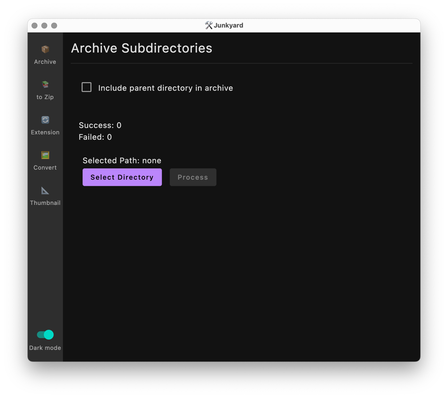
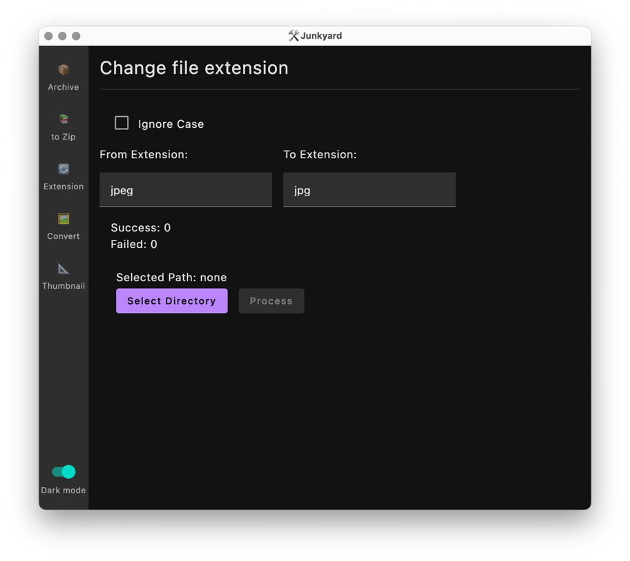

# Junkyard

## TL;DR

This is a collection of some junk tools and codes with GUI. Just for fun and learning purpose.

Some of the tools are based on: https://github.com/retheviper/PythonTools

## Features

- Archive subdirectories to zip in a directory
- Convert RAR to ZIP
- Change file extension
- Convert image format

## Screenshot






## Used Libraries

- [Compose for Desktop](https://www.jetbrains.com/lp/compose/)
- [FileKit](https://github.com/vinceglb/FileKit)
- [Junrar](https://github.com/junrar/junrar)
- [Srimage](https://github.com/sksamuel/scrimage)

## to Run

```bash
./gradlew run
```

## to Build

```bash
./gradlew package
```

and the runnable binary will be in `build/compose/binaries/main/app` directory.